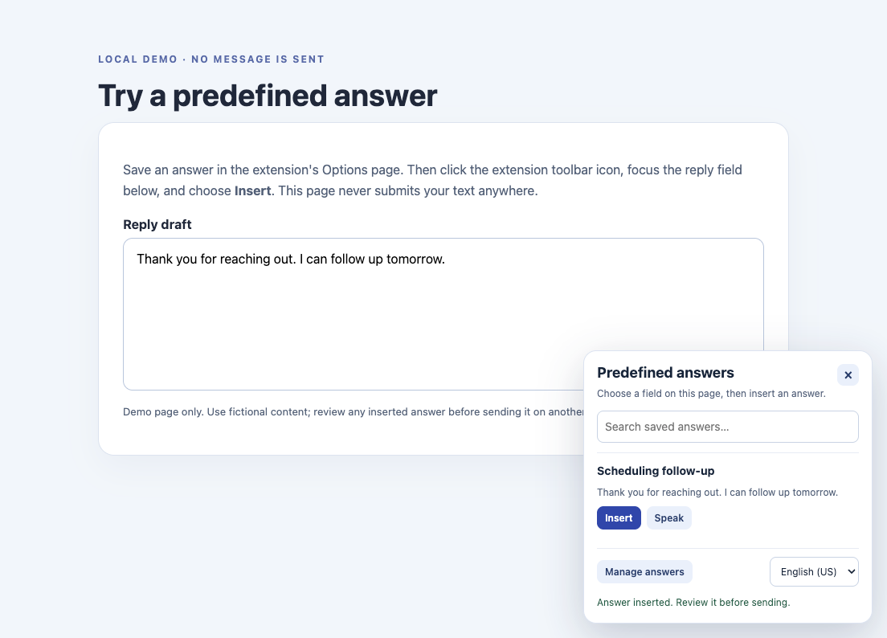

# Evenness Predefined Answers

A Chrome Manifest V3 extension for keeping reusable answers in your browser and inserting them into a text field on the current page. This is a small, dependency-free extension built from an earlier local text-to-speech prototype; it is **not** connected to an Evenness backend and does not generate answers with AI.

## Demo walkthrough

For a safe local practice page, start a static server in the repository folder with `python3 -m http.server 8765 --directory demo` and open `http://127.0.0.1:8765/try-it.html`. The page contains only a draft text field and never sends a message. Load the extension in Chrome first as described below.

The screenshot above is from an actual Chrome run on October 6, 2026: a fictional answer was saved in Options, selected from the extension panel, and inserted into the local practice page. The confirmation says to review the text before sending; no message was submitted. It is not a mockup or a Chrome Web Store listing.

1. Open the extension's **Options** page and save an answer with a short title and body, for example `Scheduling follow-up` → `Thank you for reaching out. I can follow up tomorrow.`
2. Open an ordinary webpage with a text input, textarea, or contenteditable editor. Click the extension's toolbar icon.
3. Click the destination field, search for the answer in the panel, then click **Insert**. Review the inserted text before submitting the page.
4. Edit or delete the answer from **Manage answers**. Changes appear in the panel without a reload.

No answer is submitted automatically. The extension cannot inject into Chrome internal pages, browser stores, or other protected tabs. Some rich-text editors use custom input models; if insertion does not work there, use a standard text field or paste manually.

## Install locally

1. Download or clone this repository.
2. In Chrome, open `chrome://extensions`, enable **Developer mode**, then choose **Load unpacked**.
3. Select the repository folder containing `manifest.json`.
4. Pin the extension if you want easy access to the toolbar button.

No build step, server, account, or API key is needed for predefined answers. Run `npm test` (Node.js 20+) for the pure-logic and manifest checks, or `npm run check` for syntax plus tests.

## Privacy and optional speech

Answers and the optional VoiceRSS key are stored in `chrome.storage.local` in the current browser profile; they are not Chrome-synced or committed to Git. The extension injects into the active tab only after the toolbar icon is clicked. It does not read page contents in the background or transmit saved answers by default.

The **Speak** button is optional. If you add a VoiceRSS key in Options and click Speak, the first 500 characters of that answer and the key are sent to VoiceRSS over HTTPS to generate audio. The key is not hidden from VoiceRSS or from someone with access to your Chrome profile. Do not use speech for confidential answers. There is no tested live VoiceRSS request in this repository.

## Limits and provenance

The library supports up to 100 answers, each with an 80-character title and 4,000-character body. This implementation adapts the interaction idea and optional TTS path from a local `predefined-answers-main` prototype, but replaces its always-on page overlay with on-demand injection and adds answer management, validation, tests, and corrected Manifest V3 asset/script references. This repository does not claim the underlying product or earlier prototype as solely authored here.

Automated tests cover data validation, CRUD, search, limits, manifest paths, the Options-page routing fix, and absence of embedded keys. A manual Chrome smoke test passed on the included practice page. That single test does **not** establish compatibility with every rich-text editor or replace a Chrome Web Store review.
